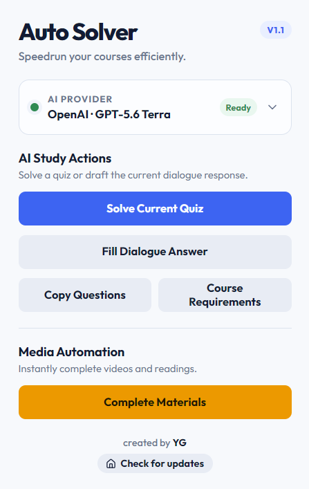

> [!CAUTION]
> ### ⚠️ Disclaimer: For Educational Purposes Only
> This extension was created strictly for **educational and learning purposes** to explore browser extension development, DOM manipulation, and API interception. 
> 
> * **No Liability:** The creator of this extension is not responsible for any consequences that may arise from using this tool.
> * **Academic Integrity:** Coursera has strict policies regarding academic integrity. Using this tool to automatically complete courses or solve quizzes may violate Coursera's Terms of Service and Honor Code.
> By using this open-source software, you agree that you are taking full responsibility for your own actions.

# Coursera Auto Solver 🎓

<div align="center">
  
  <p><em>Speedrun your courses smoothly</em></p>
</div>



🎬 **[Watch the Demo on YouTube](https://www.youtube.com/watch?v=a060UX8dlHE)**

A sleek, lightweight Chrome Extension to automate and help you navigate your Coursera courses with ease. 

## 🧪 Fork development status

This fork is currently refactoring the extension on `feat/dry-run-foundations` with an emphasis on read-only diagnostics, safer interception, course-scoped caching, modular parsing, Monaco read inspection, fixtures, and regression tests. See `docs/ARCHITECTURE.md` and PR #1 for the current migration status.

## ✨ Features

* **⚡ Media Auto-Completer:** Instantly mark all videos, readings, and supplements as complete in the background. No API key or setup required!
* **📋 Question Extractor:** Neatly extracts all quiz and assignment questions from the page into a clean format so you can easily copy them. No API key needed!
* **🎯 Course Requirements:** Finds Coursera activities that count toward the course grade, groups them by module, and opens them directly from the popup.
* **🤖 Multi-Provider Quiz Solver:** Automatically fills multiple-choice, text-input, essay, and Monaco code-expression questions with Gemini, OpenAI, Claude, xAI, DeepSeek, Groq, or OpenRouter.
* **💬 Dialogue Answer Drafting:** Reads the current Coursera Coach question and fills a suggested answer into the message box for you to review and send.
* **🎛️ Model Choice:** Pick from curated current models—including multiple Gemini, GPT, and Claude generations—or enter a custom model ID.
* **🔐 Session-Aware Request Interception:** Observes Coursera's native Fetch and XMLHttpRequest traffic to retain the current anti-CSRF request context in memory.

## 🚀 How to Use

### 1. Install the Extension
1. Clone or download this repository to your local machine.
2. Open Google Chrome and navigate to `chrome://extensions/`.
3. Enable **Developer mode** (toggle in the top right corner).
4. Click **Load unpacked** and select the folder containing this extension's files.

### 2. Configure and Run 
1. Navigate to any Coursera course page inside the `/learn/` path.
2. Click the **Coursera Auto Solver** icon in your Chrome toolbar.
3. Automatically mark course materials as complete with **Complete Materials**, extract questions with **Copy Questions**, or open grade-relevant work with **Course Requirements**.
4. Expand **AI provider** in the popup, choose a provider and model, paste your API key, and click **Save & verify**.
5. Open a Coursera quiz and click **Solve Current Quiz**. The selected provider is used until you explicitly choose and verify another one.
6. On a Coursera Coach dialogue, click **Fill Dialogue Answer** to place a draft in the message box. The extension never clicks **Send** for you.

## 🎯 Course Requirements

The **Course Requirements** feature helps learners find the activities that Coursera marks as relevant to passing a course. Instead of listing every video, reading, and practice item, it builds a focused view of graded or passable work and lets the user navigate directly to supported activities from the popup.

### What it does

When **Course Requirements** is opened, the extension:

* Loads Coursera's current course-material structure for the active `/learn/` course.
* Matches passable elements and assignment groups to their underlying course items.
* Organizes the results by module and keeps the original course order.
* Shows the activity name, type, lesson, and estimated time when available.
* Marks activities that Coursera explicitly identifies as **Required**.
* Shows relative grading-weight percentages when the returned weight data is complete enough to calculate them safely.
* Explains grouped choices such as **Pass 1 choice** when Coursera allows the learner to satisfy a requirement using one or more alternatives.
* Marks locked activities and exposes Coursera's lock reason when provided.
* Builds direct links for supported quizzes, exams, assignments, peer reviews, and programming activities.
* Marks an item as **Link unavailable** instead of inventing a route when its type cannot be mapped safely.

### How requirements are detected

The feature prefers Coursera's explicit passing metadata:

* `onDemandCourseMaterialPassableLessonElements.v1` identifies individual passable items, grading weights, and whether an item is required for passing.
* `onDemandCourseMaterialPassableItemGroups.v1` and `onDemandCourseMaterialPassableItemGroupChoices.v1` describe requirements where the learner can pass a certain number of activities from a group.
* Course modules, lessons, and material items provide names, ordering, types, lock information, time estimates, and navigation data.

When explicit passable metadata is available, the popup labels the result as based on confirmed Coursera requirements. If a course does not expose that metadata, the extension falls back to detecting common graded types such as quizzes, exams, staff-graded assignments, graded programming work, and peer reviews. Fallback results receive a **Detected** badge because their passing status could not be confirmed directly.

### What it does not do

Course Requirements is a navigation and course-structure feature. It does not:

* Read the learner's completion status or determine which requirements are already finished.
* Read the learner's current grade.
* Calculate the course's final passing threshold.
* Guarantee that completing every displayed item will pass the course.
* Include ordinary videos, readings, optional practice, or ungraded material unless Coursera explicitly references an item as part of a passable requirement.

Coursera can return incomplete or course-specific metadata. When an item cannot be resolved or linked confidently, the popup reports that limitation rather than presenting it as confirmed information.

## 🔐 Coursera Request Interception

Coursera protects state-changing API requests with session cookies and anti-CSRF headers. Those header values can change during a session, so copying or hardcoding a value is unreliable. The extension instead observes the headers already attached to Coursera's own authenticated requests.

### What changed

The interceptor now handles both networking APIs used by the Coursera web application:

* **Fetch:** Headers supplied through Fetch options or a `Request` object are converted to normalized `[name, value]` pairs.
* **XMLHttpRequest:** The extension wraps `setRequestHeader()` in addition to `open()` and `send()`. This fixes the previous behavior where XHR URLs and bodies were visible but their request headers were always empty.
* **Consistent message format:** Fetch and XHR now send headers to the content script using the same lowercase pair format.
* **Duplicate XHR headers:** Repeated calls to `setRequestHeader()` are combined using the same comma-separated behavior as the browser.

The original browser methods are still called, so interception observes the request without preventing or replacing Coursera's normal network operation.

### Captured request context

The content script retains only the following allowlisted values:

| Header | Purpose |
| --- | --- |
| `x-csrf2-cookie` | Identifies the cookie associated with Coursera's CSRF2 validation. |
| `x-csrf2-token` | Carries the current CSRF2 request token. |
| `x-csrf3-token` | Carries Coursera's CSRF3 request token and remains compatible with the existing media-completion logic. |
| `x-csrftoken` | Carries the standard web-framework CSRF token used by some Coursera endpoints. |
| `x-requested-with` | Identifies the request as an XMLHttpRequest-style browser request. |

These values are kept only in the content script's memory. They are not printed to the console, written to `chrome.storage`, committed to the repository, or displayed in the popup. Reloading or closing the Coursera tab clears them.

### Request flow

```text
Coursera creates a Fetch or XHR request
        ↓
intercept.js observes its method, URL, headers, body, and response
        ↓
Headers are normalized as lowercase [name, value] pairs
        ↓
content.js retains only the allowlisted request context
        ↓
Existing features can use the latest captured Coursera session data
```

The media-completion request currently continues to send its existing `x-csrf3-token` header. The additional CSRF2, framework CSRF, and request-type values are now captured and ready for the next compatibility update, but are not yet attached to completion requests.

### Activating interceptor updates

Because `intercept.js` is injected into Coursera's main page context when the page loads, code updates require both steps:

1. Open `chrome://extensions/` and reload the unpacked extension.
2. Refresh the open Coursera course tab so the updated interceptor is injected.

If the extension says that authentication data is missing, keep the extension enabled, refresh the course page, and interact with Coursera normally so the page can make a fresh authenticated API request.

### Supported AI providers

| Provider | Get an API key |
| --- | --- |
| Google Gemini | [Google AI Studio](https://aistudio.google.com/app/apikey) |
| OpenAI | [OpenAI API keys](https://platform.openai.com/api-keys) |
| Anthropic Claude | [Claude Console](https://console.anthropic.com/settings/keys) |
| xAI | [xAI Console](https://console.x.ai/) |
| DeepSeek | [DeepSeek Platform](https://platform.deepseek.com/api_keys) |
| Groq | [GroqCloud Console](https://console.groq.com/keys) |
| OpenRouter | [OpenRouter Keys](https://openrouter.ai/settings/keys) |

API keys are stored in `chrome.storage.local` in your Chrome profile and are sent only to the provider you select. They are not encrypted by the extension. API usage, billing, quotas, and model access are controlled by your provider account.

## 🧩 Relevant Files

| File | Responsibility |
| --- | --- |
| `intercept.js` | Runs in Coursera's main page context and normalizes Fetch/XHR request information. |
| `content.js` | Receives intercepted messages, retains the allowlisted request context, extracts course content, and applies supported page actions. |
| `background.js` | Coordinates AI-provider requests and extension background behavior. |
| `popup.html` / `popup.js` | Provides the extension controls, provider configuration, and user feedback. |
| `ai-providers.js` | Defines supported AI providers, models, endpoints, and request adapters. |

***

Created by [YG](https://github.com/Youssef-Ghafir)
